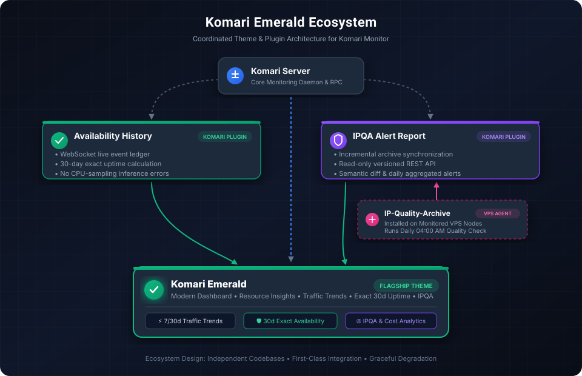

# Komari Emerald Suite

  <strong>面向 Komari 的主题与插件配套生态。</strong> 
  <em>A coordinated theme and plugin ecosystem for Komari.</em>

  
  
  

---

## 架构概览 (Architecture Overview)

Komari Emerald Ecosystem 采用**独立代码库、松耦合协作、优雅降级**的架构设计。无需合并代码库或引入重量级单体依赖，各组件即可协同提供高颜值的监控前端与专业的可用性、网络质量数据能力。

---

## 生态项目矩阵 (Ecosystem Projects)

### 1. [Komari Emerald](https://github.com/Chen017/komari-theme-emerald) (旗舰前端主题)

> **Modern Komari theme with Resource Insights, traffic trends, availability, IPQA visualization, cost and renewal analytics.**

- **仓库地址**：[Chen017/komari-theme-emerald](https://github.com/Chen017/komari-theme-emerald)
- **定位**：生态的统一可视化呈现层与交互中心。
- **核心能力**：
  - **经典监控**：轻量精致的节点网格与详情视图。
  - **每日流量趋势**：7 天 / 30 天 / 本周期流量汇聚，平滑处理重启与计数器重置。
  - **近 30 天在线率**：无缝消费 Availability History 账本，展示真实覆盖率。
  - **IP 质量概览**：无缝消费 IPQA 归档，提供节点质量卡片、风险矩阵、流媒体/AI 解锁矩阵与逐日档案回溯。
  - **成本与续费**：多币种汇率统一折算、月均与年度预算分析及续费时间轴。

---

### 2. [Availability History](https://github.com/Chen017/komari-plugin-availability-history) (在线率账本插件)

> **Event-based availability ledger and 30-day uptime API for Komari.**

- **仓库地址**：[Chen017/komari-plugin-availability-history](https://github.com/Chen017/komari-plugin-availability-history)
- **定位**：精准在线率事件提供方。
- **核心能力**：
  - **事件账本**：基于 WebSocket 实时断连事件记录真实离线，绝不依赖粗粒度 CPU 指标推断。
  - **防 Flapping**：可配置离线宽限期，避免短时网络抖动造成误报。
  - **维护停机隔离**：服务端维护或插件重启标记为 `UNOBSERVED`，不计入 VPS 故障。
  - **标准 API**：直接暴露 `GET /api/plugin/availability-history/v1/summary` 供前端渲染。

---

### 3. [IPQA Alert Report](https://github.com/Chen017/komari-plugin-ipqa-alert-report) (IP 质量平台插件)

> **IP-Quality-Archive sync, history API, semantic change tracking and aggregated alert reporting for Komari.**

- **仓库地址**：[Chen017/komari-plugin-ipqa-alert-report](https://github.com/Chen017/komari-plugin-ipqa-alert-report)
- **定位**：IPQA 数据中枢、只读 API 提供方与日常告警聚合推送器。
- **核心能力**：
  - **增量归档同步**：智能同步各 VPS 节点 `~/.ipqa/data` 归档文件到服务端。
  - **只读 REST API**：挂载 `/api/plugin/ipqa-alert-report/v1`，访客端请求纯读缓存，不触发任何远程执行。
  - **语义差异引擎**：每日自动对比相邻归档，精准捕获归属、评分、流媒体解锁与 DNSBL 变更。
  - **聚合告警通知**：每日定时聚合推送至 Telegram 等通道，智能静默无噪音。

---

### 4. [IP-Quality-Archive](https://github.com/Chen017/IP-Quality-Archive) (外部依赖 / VPS 采集器)

> **Daily IP quality collection and historical archiving tool for Linux servers.**

- **仓库地址**：[Chen017/IP-Quality-Archive](https://github.com/Chen017/IP-Quality-Archive)
- **定位**：运行于被监控 VPS 节点的轻量级质量检测与建档工具。
- **与生态的关系**：各 VPS 节点每天自动执行 IPQA 检测并生成归档，由 `komari-plugin-ipqa-alert-report` 定时拉取并交由 `komari-theme-emerald` 呈现。

---

## 设计哲学 (Design Principles)

1. **松耦合 (Decoupled)**：每个插件均可独立安装与运行，不依赖特定前端即可对外提供标准 REST API。
2. **原生适配 (First-class Integration)**：所有组件深度契合 Komari Emerald 的视觉风格与数据规范。
3. **优雅降级 (Graceful Degradation)**：若用户未安装某些插件，前端主题仍可完整运作基础监控与内置功能，并提供直达插件仓库的友好指引。
4. **统一形象 (Ecosystem Branding)**：统一的设计语言、文档结构与徽章体系，让访客在 10 秒内理解生态全貌。

---

## 快速安装组合推荐

| 需求场景 | 安装推荐 |
| :--- | :--- |
| **基础监控 + 高颜值主题** | `komari-theme-emerald` |
| **需要 30 天精确可用性与在线率** | `komari-theme-emerald` + `komari-plugin-availability-history` |
| **需要集群 IP 质量监测与风险矩阵** | `komari-theme-emerald` + `komari-plugin-ipqa-alert-report` + VPS 安装 `IP-Quality-Archive` |
| **完整全能生态体验** | **全部安装**（推荐） |

---

## GitHub Profile 展示建议 (Profile Pin Strategy)

GitHub 个人主页通常受限于 Pin 数量（最多 6 个）。使用本 Suite 仓库可作为统一入口：

- **Pin 1**：`komari-emerald-suite` (生态统一入口与全景图)
- **Pin 2**：`komari-theme-emerald` (旗舰前端主题，直观吸引用户)

无需将三个或四个子仓库全部固定，即可完美呈现完整的 Komari 监控生态。

---

## 许可证 (License)

本项目采用 [MIT License](LICENSE) 协议开源。
各子项目遵循其各自仓库中的开源协议。
